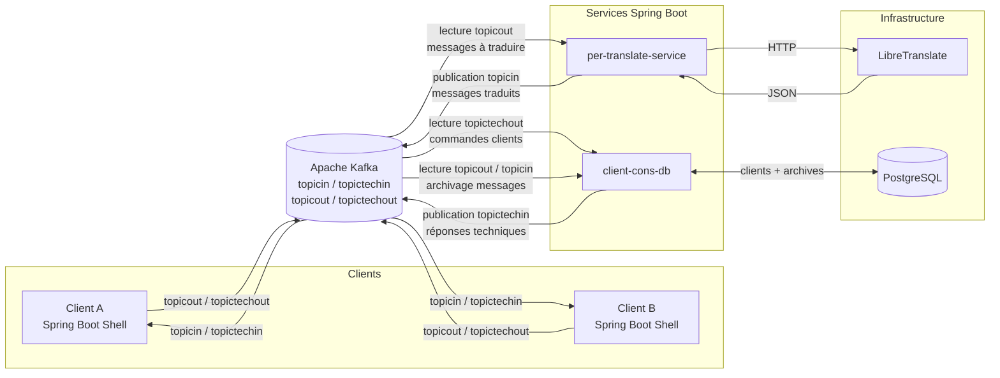

# TP Intergiciels

## Equipe
22201911: KERBELLEC **Alphonse**, alphonse.kerbellec@uphf.fr
<br>
22101912: VERZELE **Florian**, florian.verzele@uphf.fr
<br>

## Introduction
Ce projet met en place une messagerie utilisée via le terminal, offrant une fonctionnalité de traduction automatique anglais -> français pour ses utilisateurs.

## Architecture
L'architecture retenue repose sur une séparation claire entre les clients, le bus de messages, les services applicatifs et les services d'infrastructure.

Le client fourni est une application Spring Boot Shell permettant d'interagir avec la messagerie depuis un terminal. Chaque client est à la fois producteur et consommateur Kafka. Il publie ses messages applicatifs vers le topic `topicout`, lit les messages reçus depuis `topicin`, envoie ses messages techniques vers `topictechout`, et reçoit les réponses techniques depuis `topictechin`.

Les échanges sont centralisés autour d'un broker Apache Kafka. Kafka permet de découpler les clients des services : un client n'appelle jamais directement le service de traduction ni la base de données. Il se contente de publier des messages dans Kafka, puis les services spécialisés les consomment et produisent de nouveaux messages si nécessaire.

L'architecture se compose donc des éléments suivants :



## Rôle des topics Kafka
Quatre topics Kafka sont utilisés.

| Topic | Producteurs | Consommateurs | Rôle |
|---|---|---|---|
| `topicout` | Clients Shell | `per-translate-service`, `client-cons-db` | Messages applicatifs envoyés par les clients |
| `topicin` | `per-translate-service` | Clients Shell, `client-cons-db` | Messages traduits à destination des clients |
| `topictechout` | Clients Shell | `client-cons-db` | Messages techniques : connexion, déconnexion, demande de liste |
| `topictechin` | `client-cons-db` | Clients Shell | Réponses techniques envoyées aux clients |

Le choix de séparer les messages applicatifs et les messages techniques permet d'éviter de mélanger les conversations utilisateur avec les commandes internes du système. Les messages applicatifs concernent la discussion entre clients, tandis que les messages techniques concernent l'état du système : connexion d'un client, déconnexion, demande de liste des utilisateurs connectés ou vérification de disponibilité d'un destinataire.

## Service de traduction : `per-translate-service`
Le service `per-translate-service` est une application Spring Boot indépendante. Son rôle est limité à la traduction des messages applicatifs.

Son fonctionnement est le suivant :

1. le service écoute le topic Kafka `topicout` ;
2. lorsqu'un message est reçu, il extrait l'expéditeur, le destinataire et le contenu du message ;
3. il envoie le contenu textuel à LibreTranslate via une requête HTTP vers `/translate` ;
4. il récupère le champ `translatedText` de la réponse ;
5. il reconstruit un message au format attendu par le client ;
6. il publie le message traduit dans le topic `topicin`.

Le service ne communique pas directement avec PostgreSQL. Cette séparation permet de conserver une responsabilité unique : `per-translate-service` traduit, tandis que `client-cons-db` archive les messages et gère l'état des clients.

Exemple de flux :

```text
ClientA envoie :
FROM:ClientA#TO:ClientB#hello guys

per-translate-service lit le message depuis topicout,
appelle LibreTranslate,
puis publie dans topicin :

FROM:ClientA#TO:ClientB#bonjour les gars
```

## Service d'archivage et de gestion des clients : `client-cons-db`
Le service `client-cons-db` est responsable de la partie état et persistance.

Il traite deux types d'informations :

- les messages techniques venant de `topictechout` ;
- les messages applicatifs venant de `topicout` et `topicin`.

Lorsqu'un client se connecte, il envoie un message du type :

```text
CONNECT:ClientA
```

Le service enregistre alors le client en base ou met à jour son statut à connecté. Lorsqu'un client quitte l'application avec la commande byebye, le client envoie :

DISCONNECT:ClientA

Le service met alors à jour son statut à déconnecté.

Le service répond aussi aux demandes de liste des clients connectés :

GET:ClientA

Dans ce cas, il interroge PostgreSQL et renvoie la liste des clients disponibles via topictechin.

Enfin, client-cons-db archive les messages applicatifs. Les messages lus depuis topicout correspondent aux messages originaux envoyés par les clients. Les messages lus depuis topicin correspondent aux messages traduits renvoyés aux destinataires.

## Déploiement Docker
Le projet utilise Docker Compose afin de lancer les services d'infrastructure et les services applicatifs.

Les principaux conteneurs sont :

| Conteneur | Rôle |
|---|---|
| `kafka` | Broker de messages utilisé comme bus d'échange |
| `postgres-db` | Base PostgreSQL pour l'archivage et l'état des clients |
| `libretranslate` | Service local de traduction automatique |
| `per-translate-service` | Service Spring Boot chargé de traduire les messages |
| `client-cons-db` | Service Spring Boot chargé de la base de données et des messages techniques |

Kafka est configuré avec des topics auto-créés afin que les topics nécessaires soient disponibles au moment où les clients et services commencent à publier. PostgreSQL est initialisé à partir du script SQL placé dans le projet. LibreTranslate est lancé localement dans un conteneur afin d'éviter de dépendre d'une API externe.

Le client Shell n'est pas nécessairement conteneurisé, car il s'agit d'une application interactive en terminal. Il est lancé localement via les scripts fournis :

```text
start_chatting.bat ClientA
start_chatting.sh ClientA
```

## Tests réalisés

Le fonctionnement du service de traduction a été validé avec deux clients lancés simultanément.

Premier test : envoi d'un message à soi-même.

```text
ClientA -> ClientA : hello world
```
Résultat obtenu :
```text
ClientA reçoit : bonjour monde
```
Deuxième test : envoi entre deux clients. 
```text
ClientA -> ClientB : hello guys
```
Résultat attendu :
```text
ClientB reçoit : bonjour les gars
```
Ce test valide la chaîne complète suivante :
```text
Client Shell
-> Kafka topicout
-> per-translate-service
-> LibreTranslate
-> Kafka topicin
-> Client Shell destinataire
```
Ces tests montrent que le service de traduction fonctionne indépendamment du service d'archivage. L'intégration complète nécessite ensuite le fonctionnement du service client-cons-db, notamment pour la gestion des connexions, des déconnexions, de la liste des clients connectés et de l'archivage PostgreSQL.

## Limites et améliorations possibles
L'application ne met pas en place d'authentification ni de chiffrement, conformément au cadre minimal du sujet. Dans une version plus complète, il serait possible d'ajouter une authentification des utilisateurs, du chiffrement des messages, une gestion plus stricte des droits d'accès et une meilleure tolérance aux pannes.

Kafka pourrait également être déployé sous forme de cluster plutôt qu'avec un seul broker. Cela améliorerait la disponibilité du système. De même, PostgreSQL pourrait être sauvegardé ou répliqué afin de sécuriser l'archivage des échanges.

Enfin, le format textuel actuel des messages est simple à manipuler, mais il reste fragile si le contenu contient certains caractères spéciaux. Une amélioration possible serait d'utiliser un format JSON structuré pour les messages applicatifs et techniques.